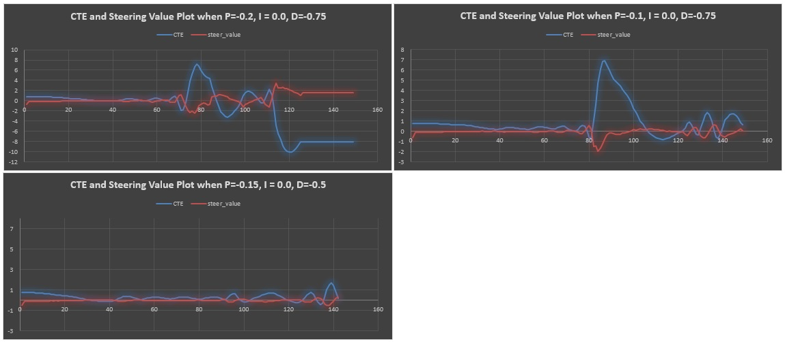
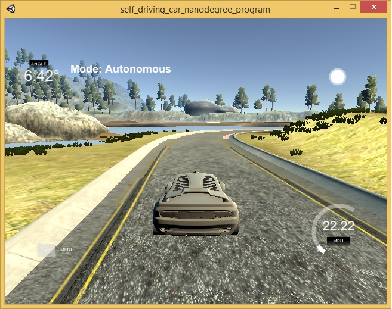

# PID Controller Project

---

## Basic Build Instructions

1. Clone this repo.
2. Make a build directory: `mkdir build && cd build`
3. Compile: `cmake .. && make`
4. Run it: `./pid`. 

## Implementation
The PID procedure is implemented as follows to minimize the cross track error:

The PID constants are tuned and the final values used are as shown below:
Kp = -0.15
Ki = 0.0
Kd = -0.5

The CTE error terms are compted as follows:
d_error = cte - p_error;
p_error = cte;
i_error += cte;
 
The total error propotional to the steering angle is computed as given below:
totalError = Kp * p_error + Ki * i_error + Kd * d_error;

## Reflection

### The effect of the P, I, D component of the PID algorithm in their implementation
The PID controler was run with Kp = 0, Ki = 0 and Kd=0
Here there was no control on the steering and the car ran out of track immediatedly

The simulation steering adjustment bias was assumed to be zero
Hence Ki was set to 0.0

It can be seen that when the Kd was high i.e -0.75 the CTE overshoot time increased
And when the Kp value was high the CTE never coverges as shown in first ans second figures
Finally when the optimum hyperparameters were choosed Kp =-0.15, Kd=-0.5 The CTE overshoot time and the propotional time were minimal as show in last figure.

### How the final hyperparameters were chosen
Various combinations of hyperparametes Kp, Ki, Kd were tried out manually to minimize CTE and control the steering angle. This was provided as input parameters to the main () function until the car was able to complete a lap around the lake track.

The final hyperparameters are: Kp=-0.15, Ki = 0.0, Kd =-0.5

## Simulation

The car complete a lap around the race track at 20 miles per hour. The below picture shows the car making a succesful turn in the simulator.

